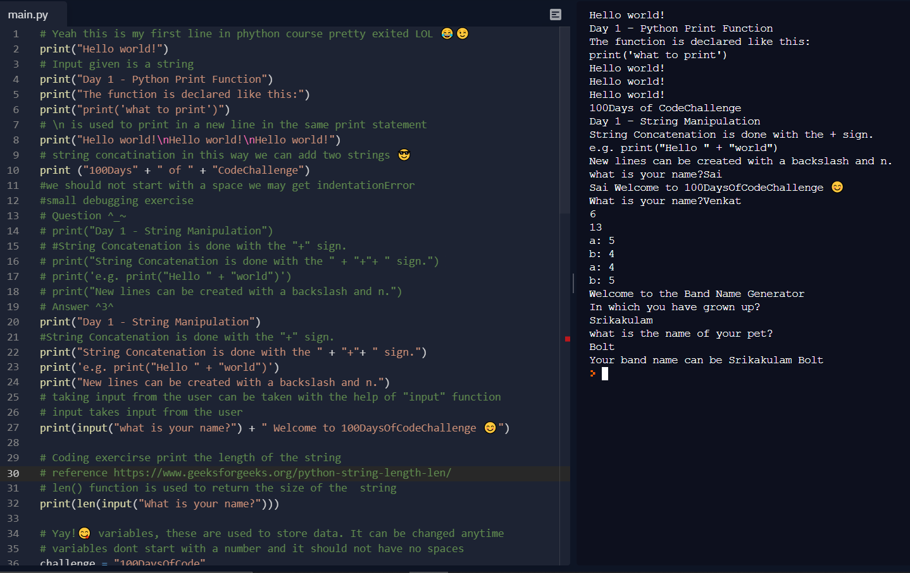
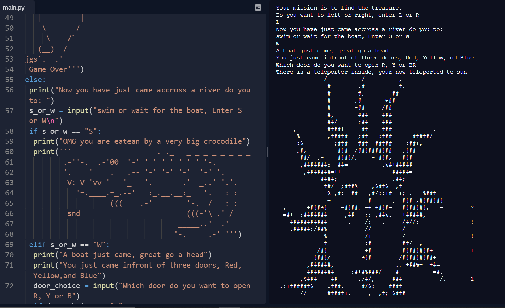
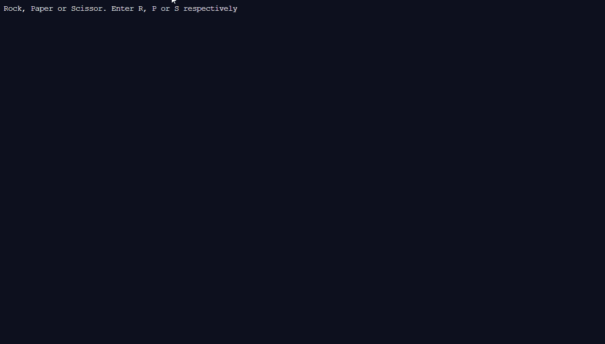
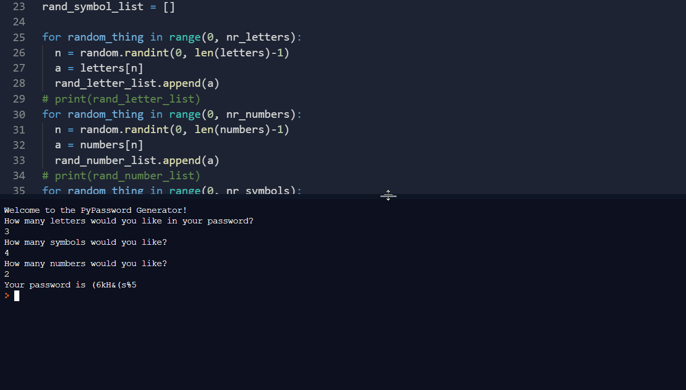
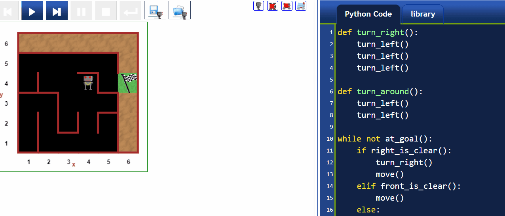

# 100DaysOfCodeChallenge
A long journey just started....

Day:- 0️⃣1️⃣ Getting started with python 🐍

Day:- 0️⃣2️⃣ Data types and strings
.png)
Day:- 0️⃣3️⃣ Conditional statements and operators

Day:- 0️⃣4️⃣ Lists, Randomizing, and use of modules

Day:- 0️⃣5️⃣ Loops
RANDOM PASSWORD GENERATOR

Day:- 0️⃣6️⃣ Functions, While loop and Reeborg's world
MAZE 

